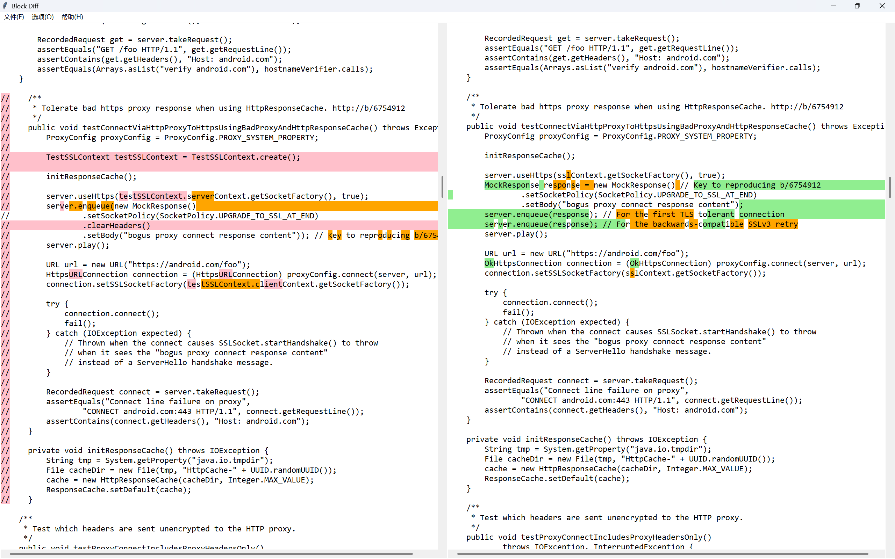

# Block Diff

> [!WARNING]
> This project is still working in progress...



## How to use

First, clone this repo and make sure your Python version is `>=3.10`.

Then, install all requirements:

```shell
pip install -r requirements.txt
```

The last, run the file ***main.py*** and have fun!

---

Currently, the project uses part of code of [meld](https://gitlab.gnome.org/GNOME/meld)!
